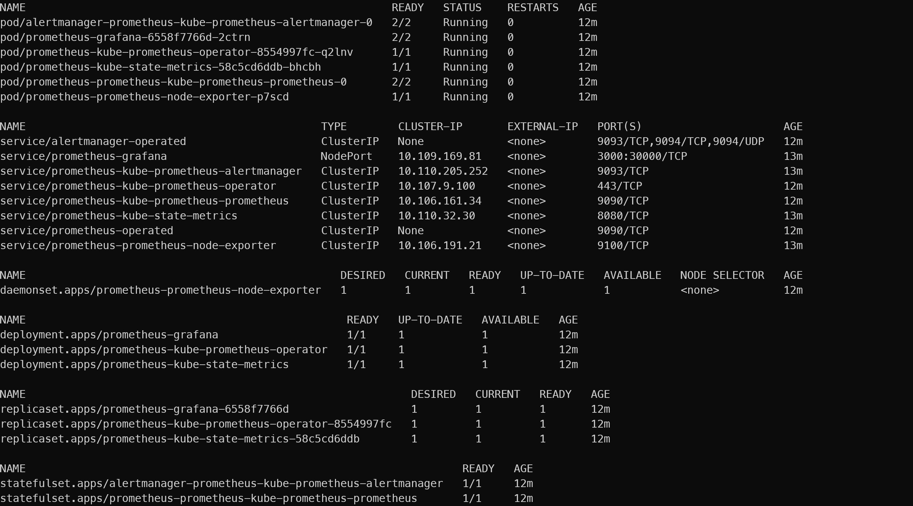
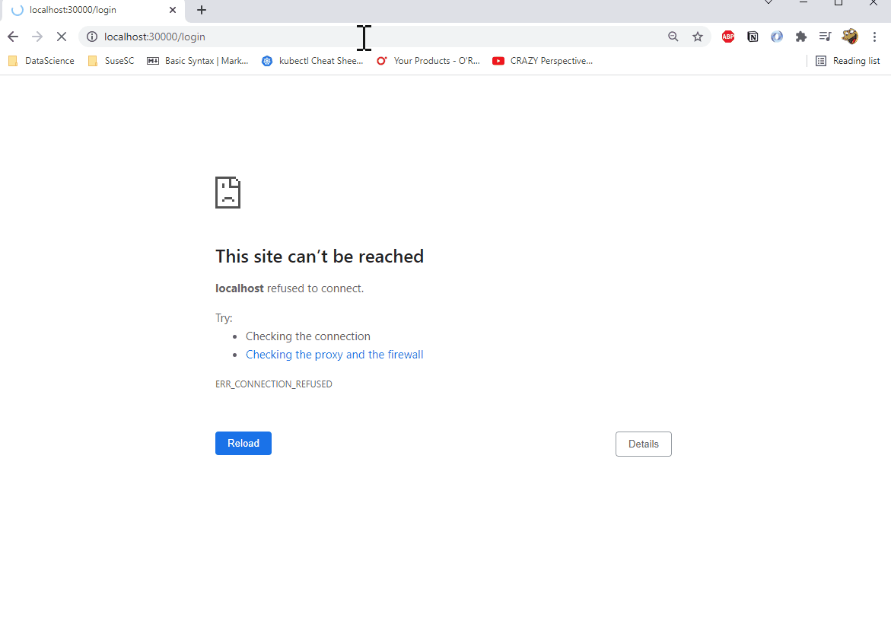
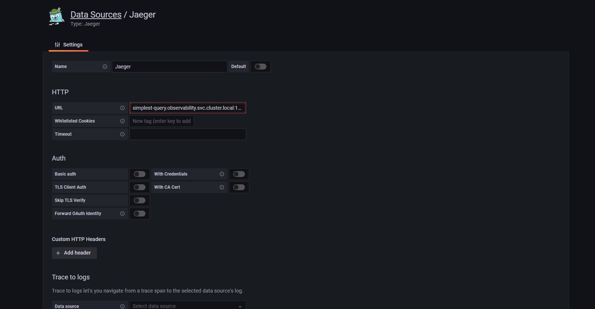
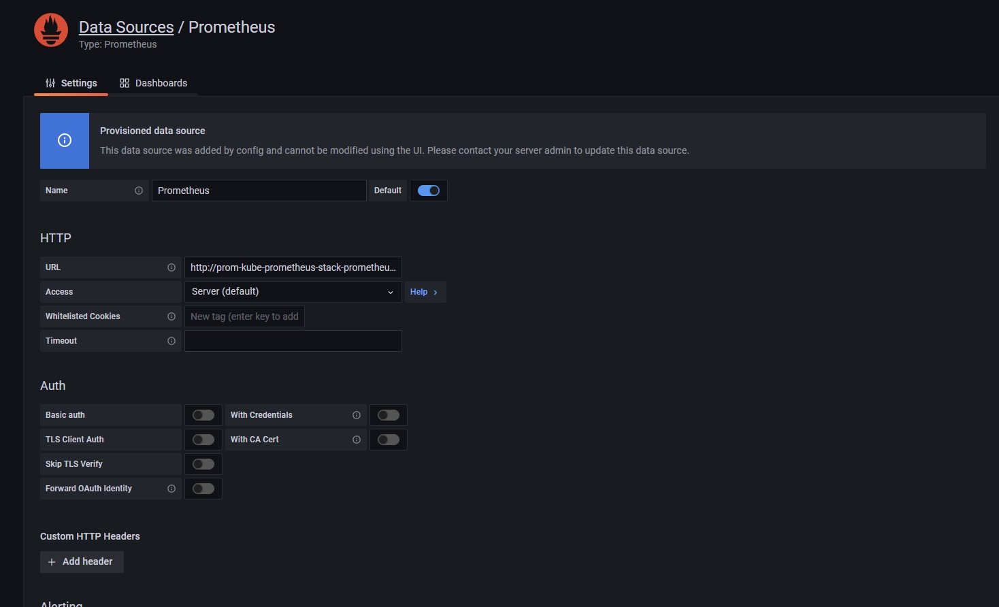
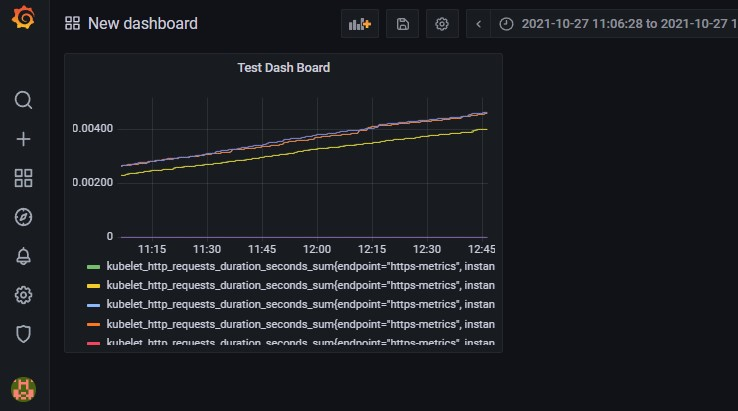

**Note:** For the screenshots, you can store all of your answer images in the `answer-img` directory.
<!--  -->

## Verify the monitoring installation

*TODO:* run `kubectl` command to show the running pods and services for all components. Take a screenshot of the output and include it here to verify the installation

## Setup the Jaeger and Prometheus source
*TODO:* Expose Grafana to the internet and then setup Prometheus as a data source. Provide a screenshot of the home page after logging into Grafana.

## Create a Basic Dashboard
*TODO:* Create a dashboard in Grafana that shows Prometheus as a source. Take a screenshot and include it here.

## Describe SLO/SLI
*TODO:* Describe, in your own words, what the SLIs are, based on an SLO of *monthly uptime* and *request response time*.

- SLIs (Service Level Indicators) are metrics tracked overtime to determine the perfomance of the service. Usually, there is a percentage and time factor to determine the intervention threshold for an SLI. For instance, if the ratio of response/request for the past 10 minute is lower than 99% then an intervenation needs to take place.

## Creating SLI metrics
*TODO:* It is important to know why we want to measure certain metrics for our customer. Describe in detail 5 metrics to measure these SLIs. 

- **Latency** is the ratio of responses that are loded within a certain time frame, usually in less than 100 ms. This measurement help determine errors when requests aren't responded in a timely manner and affects the user.
- **Availability** is the ratio of response per request that are successful. This measurement could help determine a service outage. 
- **Error rate** is the ratio of 400s, 500s responses. Similar to availability this measurement can help determine a service outage.
- **Throughput**  is the ratio of how many requests can the service handle. This measurement will alert us if there is a degredation on the system overtime. 
- **Response time** measures how long does it take for the system to return a response. Similar to latency, but this keeps track of the average response time over a period. This measure can help detect degredation on the service. 
- **Durability** measures how long storage systems suppose to retain certain data. 

## Create a Dashboard to measure our SLIs
*TODO:* Create a dashboard to measure the uptime of the frontend and backend services We will also want to measure to measure 40x and 50x errors. Create a dashboard that show these values over a 24 hour period and take a screenshot.

## Tracing our Flask App
*TODO:*  We will create a Jaeger span to measure the processes on the backend. Once you fill in the span, provide a screenshot of it here.

## Jaeger in Dashboards
*TODO:* Now that the trace is running, let's add the metric to our current Grafana dashboard. Once this is completed, provide a screenshot of it here.

## Report Error
*TODO:* Using the template below, write a trouble ticket for the developers, to explain the errors that you are seeing (400, 500, latency) and to let them know the file that is causing the issue.

TROUBLE TICKET

Name:

Date:

Subject:

Affected Area:

Severity:

Description:

## Creating SLIs and SLOs
*TODO:* We want to create an SLO guaranteeing that our application has a 99.95% uptime per month. Name three SLIs that you would use to measure the success of this SLO.

## Building KPIs for our plan
*TODO*: Now that we have our SLIs and SLOs, create KPIs to accurately measure these metrics. We will make a dashboard for this, but first write them down here.

## Final Dashboard
*TODO*: Create a Dashboard containing graphs that capture all the metrics of your KPIs and adequately representing your SLIs and SLOs. Include a screenshot of the dashboard here, and write a text description of what graphs are represented in the dashboard.  
